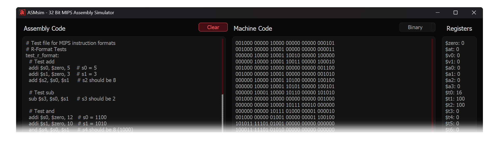

# ASMsim: 32 Bit MIPS Simulator

**ASMsim** is a real-time simulator for 32 bit MIPS assembly code developed as part of a Computer Organization course project. This educational tool helps students understand MIPS assembly programming concepts while earning course credit through hands-on experience with assembly language simulation.
  
---
## Features

- Real-time assembly simulation
- Intuitive graphical user interface
- Step-by-step execution
- Register and memory monitoring
- Cross-platform support (Windows, macOS, Linux)

## Supported Instructions

ASMsim supports common MIPS32 instructions including:

- Arithmetic: `add`, `sub`, `sll`, etc.
- Logical: `and`, `or`, etc. 
- Memory: `lw`, `sw`
- Branch/Jump: `beq`, `bne`, `j`, etc.
- See [full instruction list](usage.md#supported-instructions) for details

## Contributing

Contributions are welcome! Please feel free to submit a Pull Request. For major changes, please open an issue first to discuss what you would like to change.

## License

This project is licensed under the MIT License - see the [LICENSE](https://github.com/theEMA-dev/asmsim/blob/master/LICENSE) file for details.

## About

Developed by [Emir Kaynar](https://emirkaynar.com) and [Şamil Keklikoğlu](https://www.linkedin.com/in/%C5%9Famil-kekliko%C4%9Flu-786362256)

*[MIPS]: (Microprocessor without Interlocked Pipelined Stages) is a family of reduced instruction set computer (RISC) instruction set architectures